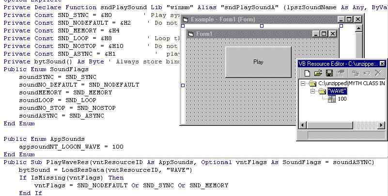

## Play Wav from res file \(without extacting it\)\.

### Description

This plays wav files from inside the app it doesnt extact them or anything just plays it only 30 lines. vote
 
### More Info
 

             |
---                |---
**Submitted On**   |2003-05-19 19:34:54
**By**             |[RPG MAKER](https://github.com/Planet-Source-Code/PSCIndex/blob/master/ByAuthor/rpg-maker.md)
**Level**          |Intermediate
**User Rating**    |3.8 (15 globes from 4 users)
**Compatibility**  |VB 3\.0, VB 4\.0 \(16\-bit\), VB 4\.0 \(32\-bit\), VB 5\.0, VB 6\.0
**Category**       |[Coding Standards](https://github.com/Planet-Source-Code/PSCIndex/blob/master/ByCategory/coding-standards__1-43.md)
**World**          |[Visual Basic](https://github.com/Planet-Source-Code/PSCIndex/blob/master/ByWorld/visual-basic.md)
**Archive File**   |[Play\_Wav\_f1589655192003\.zip](https://github.com/Planet-Source-Code/rpg-maker-play-wav-from-res-file-without-extacting-it__1-45581/archive/master.zip)

